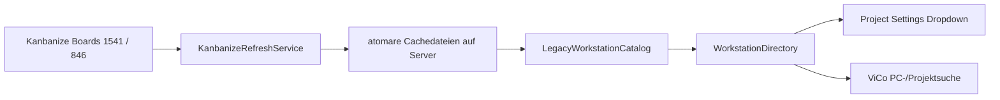
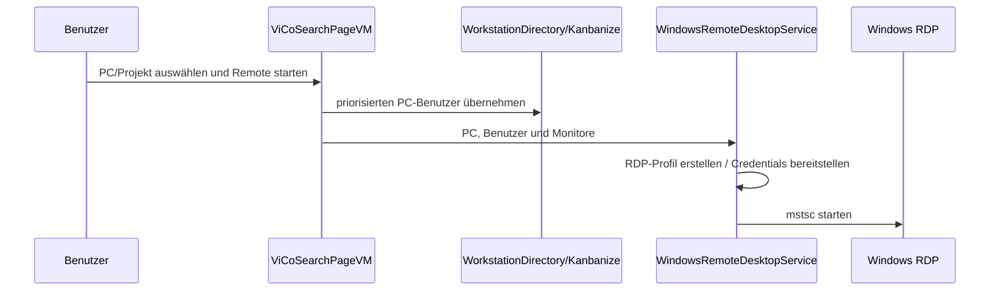
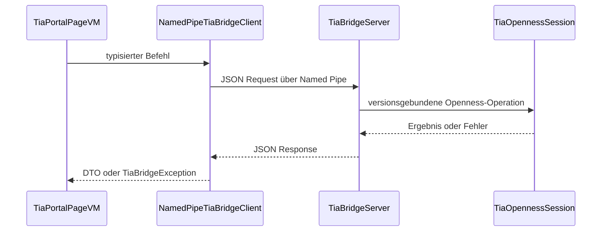
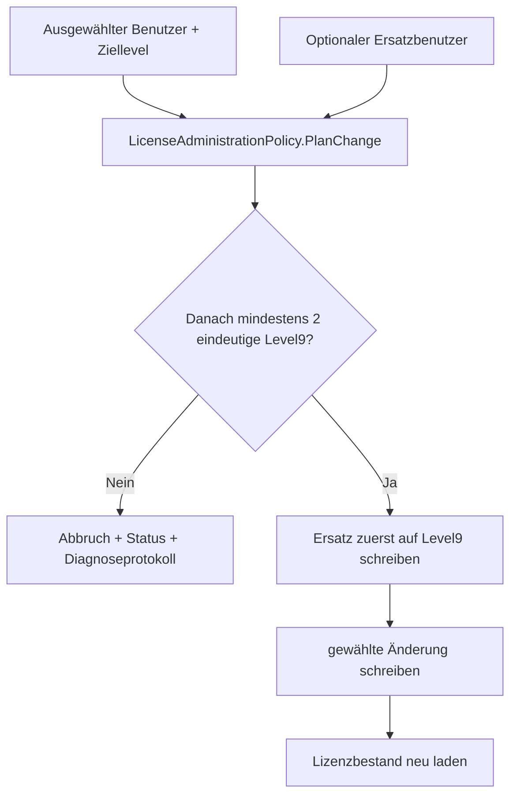

# Datenflüsse

## PC- und Benutzerbestand

Beim Start wird der vorhandene Cache gelesen. Eine Online-Aktualisierung lädt PC- und Robotikdaten, ersetzt die Cachedateien und synchronisiert danach das gemeinsame Verzeichnis. Kanbanize ist bei widersprüchlichen Benutzern die maßgebliche Quelle.

## Remote-Verbindung

## TIA-Operation

## Lizenzänderung

## Diagnose

ViewModels melden bedienbare Texte an `IApplicationLog`. `ApplicationLogService` hält höchstens 500 sichtbare Einträge und leitet dieselben Ereignisse an NLog weiter. Dadurch bleibt die Oberfläche begrenzt, während rotierende Dateien eine spätere Analyse erlauben.
