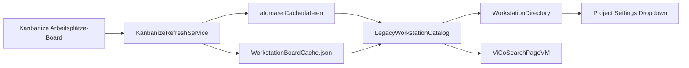
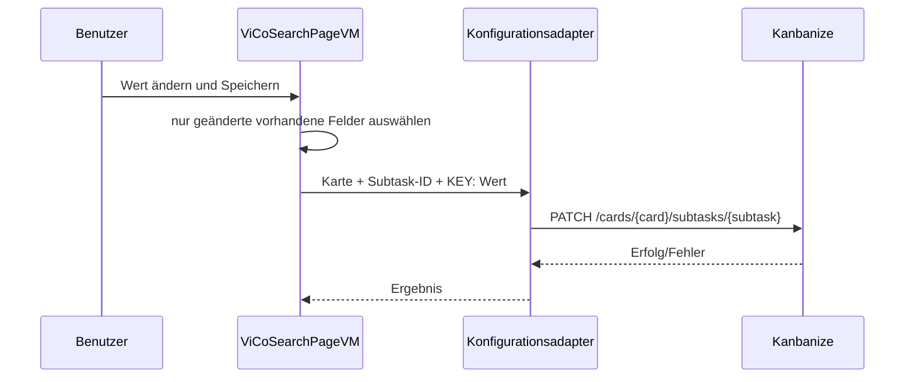
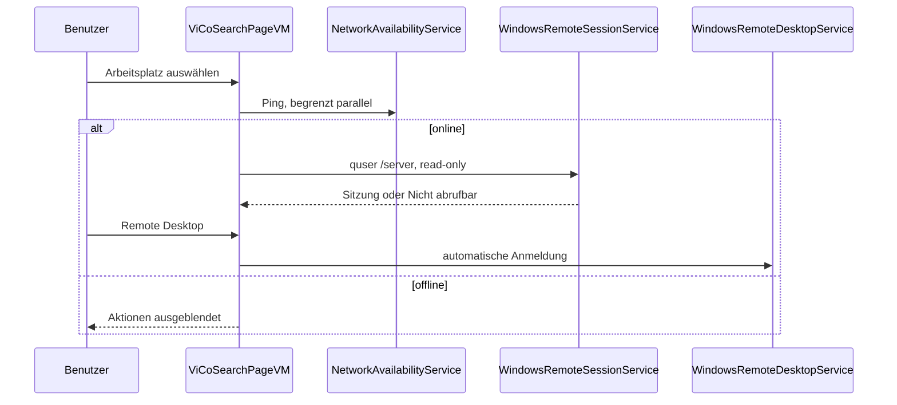
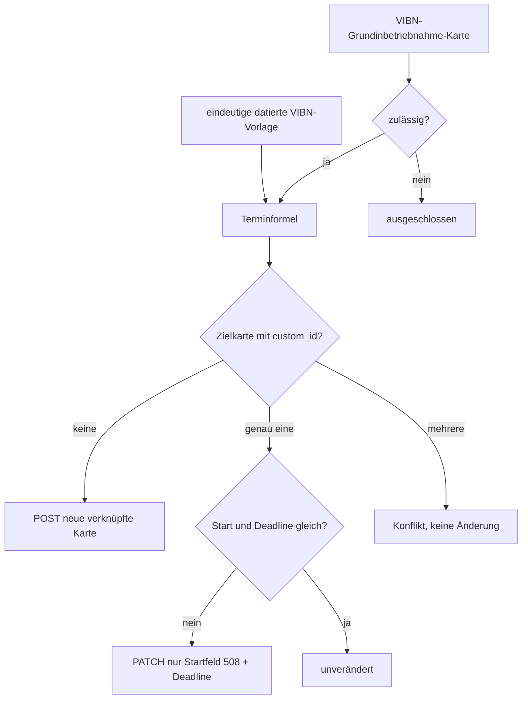
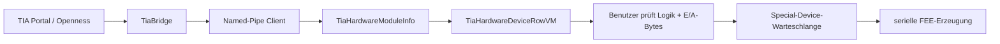
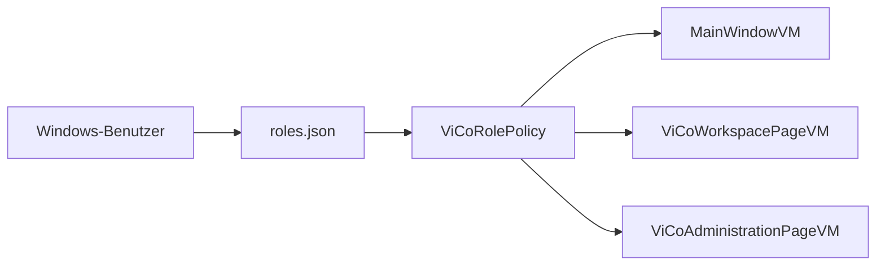

# Datenflüsse

## Arbeitsplatzbestand und Konfiguration

`WorkstationBoardCache.json` bewahrt Karten- und Unteraufgaben-IDs der `KONFIGURATION`-Karte. `LegacyWorkstationCatalog` verbindet sie über die Lane mit dem Arbeitsplatz. Der Wert `USER:` hat Vorrang vor älteren Textkarten; damit nutzen ViCo und Project Settings dieselbe dynamische PC-Benutzer-Zuordnung.

Beim Speichern der Konfiguration läuft der Datenfluss nur in die Gegenrichtung der vorhandenen Unteraufgabe:

Andere Kartenfelder und nicht vorhandene Unteraufgaben werden nie geschrieben.

## Remote Desktop und Sitzungsauskunft

Die alternative Schaltfläche „Remote Desktop mit Anmeldedaten“ ruft denselben RDP-Adapter mit `prompt for credentials:i:1` auf. Sie dient auch zur einmaligen Einrichtung oder Änderung der lokalen Windows-RDP-Anmeldung. Der normale Start nutzt `prompt for credentials:i:0` und damit ausschließlich den gespeicherten Windows-Eintrag; das Tool übergibt oder speichert kein Kennwort.

## Kanbanize VIBN → Arbeitsplätze

Die Formel ist Start = Quell-Deadline − 14 Tage, Ende = Deadline der eindeutigen Vorlage + 56 Tage. Fehlende oder mehrdeutige Voraussetzungen sind Konflikte ohne Schreiboperation.

## TIA-Hardware und Special Devices

Bis zur letzten Aktion ist der Ablauf read-only. Die TIA-Bridge liest Modul, Typ, Slot und Eingangs-/Ausgangsbyte. Erst das bestätigte Erzeugen verändert die FEE-Simulation.

## Rollen

Die gleiche Policy regelt Hauptreiter, Verwaltungsreiter und Schreibrecht. Beim Speichern validiert sie `lutzma` als Level9 und mindestens zwei unterschiedliche Level9-Benutzer.
